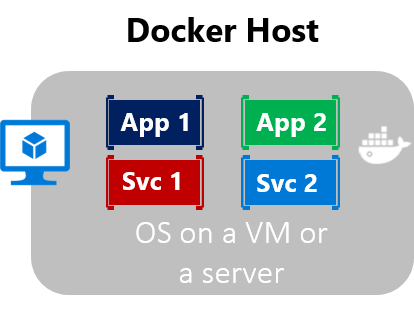
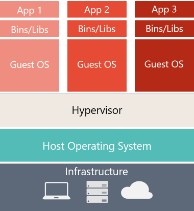
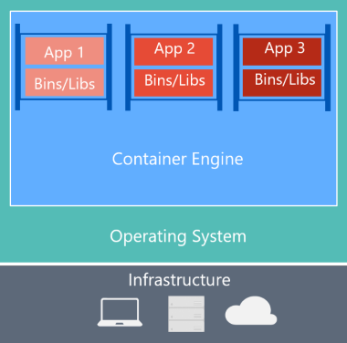

# APP30 Demo Instructions

# Abstract

_Tailwind Traders’ recently moved one of its core applications  from a virtual machine into containers, gaining deployment flexibility and repeatable builds._

_In this session, you’ll learn how to manage containers for deployment, options for container registries, and ways to manage and scale deployed containers. You’ll also learn how Tailwind Traders uses Azure Key Vault service to store application secrets and make it easier for their applications to securely access business critical data._

### The Intro

**Welcome to APP30**

Goals: Is a feature, since Docker 17.05 or higher, that helps to reduce the size of the final images. In a few sentences, with multi-stage build you can use, for example, a large base image, containing the SDK, for compiling and publishing the application and then using the publishing folder with a small runtime-only base image, to produce a much smaller final image:

1. Look at the new ways we can host our web applications and databases in the cloud.  
2. Discuss containers: what they are and how they can help improve modernize our application deployments
3. Introduce Docker, Dockerfiles and how to begin containerizing your apps.
4. What's a Docker Registry and how we'll use one along with Azure.
5. Introduce Web App for Containers - Allow you to host your application end to end without all the management.  
6. Key Vault - How do we secure our secrets?
7. Database as a service - implementing our app with a fully managed database in the cloud.
8. Demo!

### Where are your Apps?

Not the app store, not in a package manager, I mean where are they hosted?

Are they in a datacenter?  Still on a dedicated server costing the business tons in fixed cost on applications that have an assumed scale.

YIKES. This probably hits a little too close to home for some people in this room. I know I’ve worked at places that weren’t a far cry from this. 

So this is where many of us are hosting our apps.

Why? 

The cloud is here and it is AWESOME.

I get it – applications have been around for a long time and everyone is afraid to touch them. But there are some serious – and I mean SERIOUS benefits to moving to the cloud. 

That means there are some serious drawbacks to keeping your apps in your own data center.

### Drawbacks to your datacenter hosted application.

I look at remaining in the datacenter as kind of being “stuck in the middle” – you’re making decisions without having data provided to you 

* Physical infrastructure requires large Capital Expenditure.
* You are essentially assuming scale with static hardware.
* Expensive compliance requirements.

### Benefits hosting in Azure

* No more hardware to manage
* Always up to date
* Flexible costs 
* Faster deployment

### To the cloud!

The benefits of moving to the cloud are clear – the ability to modify, scale and reduce your architecture on demand.  

Let’s walk through how we can get the process started and all the benefits you’ll get from moving your datacenter hosted application to the cloud using containers.

### Introduction to Containers and Docker

[Containerization](https://docs.microsoft.com/en-us/dotnet/architecture/microservices/container-docker-introduction/) is an approach to software development in which an application or service, its dependencies, and its configuration (abstracted as deployment manifest files) are packaged together as a container image. The containerized application can be tested as a unit and deployed as a container image instance to the host operating system (OS).

Containers also isolate applications from each other on a shared OS. Containerized applications run on top of a container host that in turn runs on the OS (Linux or Windows). Containers therefore have a significantly smaller footprint than virtual machine (VM) images.

Each container can run a whole web application or a service, as shown in Figure 2-1. In this example, Docker host is a container host, and App1, App2, Svc 1, and Svc 2 are containerized applications or services.

Another benefit of containerization is scalability. You can scale out quickly by creating new containers for short-term tasks. From an application point of view, instantiating an image (creating a container) is similar to instantiating a process like a service or web app. For reliability, however, when you run multiple instances of the same image across multiple host servers, you typically want each container (image instance) to run in a different host server or VM in different fault domains.

In short, containers offer the benefits of isolation, portability, agility, scalability, and control across the whole application lifecycle workflow. The most important benefit is the environment's isolation provided between Dev and Ops.

### What is Docker?

Docker is an open-source project for automating the deployment of applications as portable, self-sufficient containers that can run on the cloud or on-premises. Docker is also a company that promotes and evolves this technology, working in collaboration with cloud, Linux, and Windows vendors, including Microsoft.

Developers can use development environments on Windows, Linux, or macOS. On the development computer, the developer runs a Docker host where Docker images are deployed, including the app and its dependencies. Developers who work on Linux or on the Mac use a Docker host that is Linux based, and they can create images only for Linux containers. (Developers working on the Mac can edit code or run the Docker CLI from macOS, but as of the time of this writing, containers don't run directly on macOS.) Developers who work on Windows can create images for either Linux or Windows Containers.

To host containers in development environments and provide additional developer tools, Docker ships Docker Community Edition (CE) for Windows or for macOS. These products install the necessary VM (the Docker host) to host the containers. Docker also makes available Docker Enterprise Edition (EE), which is designed for enterprise development and is used by IT teams who build, ship, and run large business-critical applications in production.

| Virtual Machines | Docker Containers |
| -----------------| ------------------|
|||
|Virtual machines include the application, the required libraries or binaries, and a full guest operating system. Full virtualization requires more resources than containerization. | Containers include the application and all its dependencies. However, they share the OS kernel with other containers, running as isolated processes in user space on the host operating system. (Except in Hyper-V containers, where each container runs inside of a special virtual machine per container.) |

### Docker images

Container image: A package with all the dependencies and information needed to create a container. An image includes all the dependencies (such as frameworks) plus deployment and execution configuration to be used by a container runtime. Usually, an image derives from multiple base images that are layers stacked on top of each other to form the container's filesystem. An image is immutable once it has been created.

### Dockerfiles

A Dockerfile is a text document that contains all the commands a user could call on the command line to assemble an image. Using docker build users can create an automated build that executes several command-line instructions in succession.

You can specify your operating system or runtime required for your application here as well as how the application will be built. Think of your Dockerfile as another piece of software you maintain along with your app.  You'll manage this within your git repository. 

Multi-stage builds are a feature, since Docker 17.05 or higher, that helps to reduce the size of the final images. In a few sentences, with multi-stage build you can use, for example, a large base image, containing the SDK, for compiling and publishing the application and then using the publishing folder with a small runtime-only base image, to produce a much smaller final image

### Docker Registry and Azure Container Registry

A registry is a storage and content delivery system, holding named Docker images, available in different tagged versions.

An Azure container registry is a private Docker registry in Azure where you can store and manage your private Docker container images. In this quickstart, you create a container registry with the Azure portal. Then, use Docker commands to push a container image into the registry, and finally pull and run the image from your registry.

### Databases

Another major part of moderinzing our applications is reducing the amount of overhead that comes along with hosting our databases.  Modern database hosting via "Database as a service" offerings such as Azure MSSQL and Cosmos DB allow teams to get the most out of their data without all the administration.  

Take away the need to run backups, configure replication and failover by using these services rather than hosting your own databases on a VM.

Azure SQL Database is a general-purpose relational database-as-a-service (DBaaS) based on the latest stable version of Microsoft SQL Server Database Engine. SQL Database is a high-performance, reliable, and secure cloud database that you can use to build data-driven applications and websites in the programming language of your choice, without needing to manage infrastructure.

Azure Cosmos DB is a fully managed database service with turnkey global distribution and transparent multi-master replication. You can run globally distributed, low-latency operational and analytics workloads and AI on transactional data within your database

### Key Vault

Azure Key Vault is a tool for securely storing and accessing secrets. A secret is anything that you want to tightly control access to, such as API keys, passwords, or certificates. A vault is logical group of secrets.

